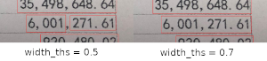

# EasyOCR

[](https://badge.fury.io/py/easyocr)
[](https://github.com/JaidedAI/EasyOCR/blob/master/LICENSE)
[](https://colab.fan/easyocr)
[](https://twitter.com/intent/tweet?text=Check%20out%20this%20awesome%20library:%20EasyOCR%20https://github.com/JaidedAI/EasyOCR)
[](https://twitter.com/JaidedAI)

Ready-to-use OCR with 40+ languages supported including Chinese, Japanese, Korean and Thai.

## What's new?
- 24 July 2020 - Version 1.1.5
    - New language support for Hindi, Marathi, Nepali (Devanagari Script)
    - Automatic word merging into paragraph (Use this feature by setting `readtext`'s parameter `'paragraph' = True`)

## What's coming next?
- [New language support](https://github.com/JaidedAI/EasyOCR/issues/91)

## Examples


## Supported Languages

We are currently supporting the following 54 languages.

Afrikaans (af), Azerbaijani (az), Belarusian (be), Bulgarian (bg), Bosnian (bs),
Simplified Chinese (ch_sim), Traditional Chinese (ch_tra), Czech (cs), Welsh (cy),
Danish (da), German (de), English (en), Spanish (es), Estonian (et),
French (fr), Irish (ga), Hindi(hi), Croatian (hr), Hungarian (hu),
Indonesian (id), Icelandic (is), Italian (it), Japanese (ja), Korean (ko),
Kurdish (ku), Latin (la), Lithuanian (lt), Latvian (lv), Maori (mi), Mongolian (mn),
Marathi (mr), Malay (ms), Maltese (mt), Nepali (ne), Dutch (nl), Norwegian (no),
Occitan (oc), Polish (pl), Portuguese (pt), Romanian (ro), Russian (ru),
Serbian (cyrillic)(rs_cyrillic), Serbian (latin)(rs_latin), 
Slovak (sk) (need revisit), Slovenian (sl), Albanian (sq), Swedish (sv),
Swahili (sw), Thai (th), Tagalog (tl), Turkish (tr), Ukranian(uk), Uzbek (uz),
Vietnamese (vi) (need revisit)

List of characters is in folder [easyocr/character](https://github.com/JaidedAI/EasyOCR/tree/master/easyocr/character).
If you are native speaker of any language and think we should add or remove any character,
please create an issue and/or pull request (like [this one](https://github.com/JaidedAI/EasyOCR/pull/15)).

## Installation

Install using `pip` for stable release,

``` bash
pip install easyocr
```

For latest development release,

``` bash
pip install git+git://github.com/jaidedai/easyocr.git
```

Note 1: for Windows, please install torch and torchvision first by following the official instruction here https://pytorch.org. On pytorch website, be sure to select the right CUDA version you have. If you intend to run on CPU mode only, select CUDA = None.

Note 2: We also provide Dockerfile [here](https://github.com/JaidedAI/EasyOCR/blob/master/Dockerfile).

#### Try Third-Party Demos

1. [Google Colab](https://colab.fan/easyocr)
2. [Dockerhub](https://hub.docker.com/r/challisa/easyocr)
3. [Ainize](https://easyocrgpu-wook-2.endpoint.ainize.ai/)

## Usage

``` python
import easyocr
reader = easyocr.Reader(['ch_sim','en'])
reader.readtext('chinese.jpg')
```

Output will be in list format, each item represents bounding box, text and confident level, respectively.

``` bash
[([[189, 75], [469, 75], [469, 165], [189, 165]], '愚园路', 0.3754989504814148),
 ([[86, 80], [134, 80], [134, 128], [86, 128]], '西', 0.40452659130096436),
 ([[517, 81], [565, 81], [565, 123], [517, 123]], '东', 0.9989598989486694),
 ([[78, 126], [136, 126], [136, 156], [78, 156]], '315', 0.8125889301300049),
 ([[514, 126], [574, 126], [574, 156], [514, 156]], '309', 0.4971577227115631),
 ([[226, 170], [414, 170], [414, 220], [226, 220]], 'Yuyuan Rd.', 0.8261902332305908),
 ([[79, 173], [125, 173], [125, 213], [79, 213]], 'W', 0.9848111271858215),
 ([[529, 173], [569, 173], [569, 213], [529, 213]], 'E', 0.8405593633651733)]
```
Note 1: `['ch_sim','en']` is the list of languages you want to read. You can pass
several languages at once but not all languages can be used together.
English is compatible with every languages. Languages that share common characters are usually compatible with each other.

Note 2: Instead of filepath `chinese.jpg`, you can also pass OpenCV image object (numpy array) or image file as bytes. URL to raw image is also acceptable.

You can also set `detail` = 0 for simpler output.

``` python
reader.readtext('chinese.jpg', detail = 0)
```
Result:
``` bash
['愚园路', '西', '东', '315', '309', 'Yuyuan Rd.', 'W', 'E']
```

Model weight for chosen language will be automatically downloaded or you can
download it manually from the following links and put it in '~/.EasyOCR/model' folder

- [text detection model](https://drive.google.com/file/d/1tdItXPoFFeKBtkxb9HBYdBGo-SyMg1m0/view?usp=sharing)
- [latin model](https://drive.google.com/file/d/1M7Lj3OtUsaoppD4ZKudjepzCMsXKlxp3/view?usp=sharing)
- [chinese (traditional) model](https://drive.google.com/file/d/1xWyQC9NIZHNtgz57yofgj2N91rpwBrjh/view?usp=sharing)
- [chinese (simplified) model](https://drive.google.com/file/d/1-jN_R1M4tdlWunRnD5T_Yqb7Io5nNJoR/view?usp=sharing)
- [japanese model](https://drive.google.com/file/d/1ftAeVI6W8HvpLL1EwrQdvuLss23vYqPu/view?usp=sharing)
- [korean model](https://drive.google.com/file/d/1UBKX7dHybcwKK_i2fYx_CXaL1hrTzQ6y/view?usp=sharing)
- [thai model](https://drive.google.com/file/d/14BEuxcfmS0qWi3m9RsxwcUsjavM3rFMa/view?usp=sharing)
- [devanagari model](https://drive.google.com/file/d/1uCiMuBl8H8GAwapEjYUVYYdoOivyGzel/view?usp=sharing)
- [cyrillic model](https://drive.google.com/file/d/1SBmKXV5dpN5Cekacqk3ms1xq3dGbDuu1/view?usp=sharing)

In case you do not have GPU or your GPU has low memory, you can run it in CPU mode by adding gpu = False

``` python
reader = easyocr.Reader(['th','en'], gpu = False)
```

See [Documentation](#API-Documentation)

#### Run on command line

```shell
$ easyocr -l ch_sim en -f chinese.jpg --detail=1 --gpu=True
```

## Implementation Roadmap

#### Phase 1 (Now - October, 2020)

1. Language packs: Hindi, Arabic, Cyrillic alphabet, etc. Aiming to cover > 80-90% of world's population. See [current development list](https://github.com/JaidedAI/EasyOCR/issues/91). Also improve existing languages.
2. Better documentation and api
3. Language model for better decoding

#### Phase 2 (After October, 2020)

1. Handwritten support: Network architecture should not matter.
The key is using GAN to generate realistic handwritten dataset.
2. Faster processing time: model pruning (lite version) / quantization / export to other platforms (ONNX?)
3. Open Dataset and model training pipeline
4. Restructure code to support swappable detection and recognition algorithm.
The api should be as easy as
``` python
reader = easyocr.Reader(['en'], detection='DB', recognition = 'ReXNet_LSTM_Attention')
```
The idea is to be able to plug-in any state-of-the-art model into EasyOCR. There are a lot of geniuses trying to make better detection/recognition model. We are not trying to be a genius here, just make genius's works quickly accessible to the public ... for free. (well I believe most geniuses want their work to create positive impact as fast/big as possible) The pipeline should be something like below diagram. Grey slots are placeholders for changeable light blue modules.


## Acknowledgement and References

This project is based on researches/codes from several papers/open-source repositories.

Detection part is using CRAFT algorithm from this [official repository](https://github.com/clovaai/CRAFT-pytorch) and their [paper](https://arxiv.org/abs/1904.01941).

Recognition model is CRNN ([paper](https://arxiv.org/abs/1507.05717)). It is composed of 3 main components, feature extraction (we are currently using [Resnet](https://arxiv.org/abs/1512.03385)), sequence labeling ([LSTM](https://www.bioinf.jku.at/publications/older/2604.pdf)) and decoding ([CTC](https://www.cs.toronto.edu/~graves/icml_2006.pdf)). Training pipeline for recognition part is a modified version from this [repository](https://github.com/clovaai/deep-text-recognition-benchmark).

Beam search code is based on this [repository](https://github.com/githubharald/CTCDecoder) and his [blog](https://towardsdatascience.com/beam-search-decoding-in-ctc-trained-neural-networks-5a889a3d85a7).

And good read about CTC from distill.pub [here](https://distill.pub/2017/ctc/).

## Want To Contribute?

Let's advance humanity together by making AI available to everyone!

3 ways to contribute:

**Coder:** Please send PR for small bug/improvement. For bigger one, discuss with us by open an issue first. There is a list of possible bug/improvement issue tagged with ['PR WELCOME'](https://github.com/JaidedAI/EasyOCR/issues?q=is%3Aissue+is%3Aopen+label%3A%22PR+WELCOME%22).

**User:** Tell us how EasyOCR benefit you/your organization in [Book of Gratitude](https://github.com/JaidedAI/EasyOCR/issues/160) to encourage further development. Also post failure cases in [Book of Pain](https://github.com/JaidedAI/EasyOCR/issues/161) to help improving future model.

**Tech leader/Guru:** If you found this library useful, please spread the word! (See [Yann Lecun's post](https://www.facebook.com/yann.lecun/posts/10157018122787143) about EasyOCR)

## Guideline for new language request

To request a new language support, I need you to send a PR with 2 following files

1. In folder [easyocr/character](https://github.com/JaidedAI/EasyOCR/tree/master/easyocr/character),
we need 'yourlanguagecode_char.txt' that contains list of all characters. Please see format example from other files in that folder.
2. In folder [easyocr/dict](https://github.com/JaidedAI/EasyOCR/tree/master/easyocr/dict),
we need 'yourlanguagecode.txt' that contains list of words in your language.
On average we have ~30000 words per language with more than 50000 words for popular one.
More is better in this file.

If your language has unique elements (such as 1. Arabic: characters change form when attach to each other + write from right to left 2. Thai: Some characters need to be above the line and some below), please educate me with your best ability and/or give useful links. It is important to take care of the detail to achieve a system that really works.

Lastly, please understand that my priority will have to go to popular language or set of languages that share most of characters together (also tell me if your language share a lot of characters with other). It takes me at least a week to work for new model. You may have to wait a while for new model to be released.

See [List of languages in development](https://github.com/JaidedAI/EasyOCR/issues/91)

## API Documentation

#### `Reader` class
> Base class for EasyOCR
>
> **Parameters**
> * **lang_list** (list) - list of language code you want to recognize, for example ['ch_sim','en']. List of supported language code is [here](#Supported-Languages).
> * **gpu** (bool, string, default = True)
>
> **Attribute**
> * **lang_char** - Show all available characters in current model

#### `readtext` method
> Main method for Reader object. There are 4 groups of parameter: General,
Contrast, Text Detection and Bounding Box Merging.
>
> **Parameters 1: General**
> * **image** (string, numpy array, byte) - Input image
> * **decoder** (string, default = 'greedy') - options are 'greedy', 'beamsearch' and 'wordbeamsearch'.
> * **beamWidth** (int, default = 5) - How many beam to keep when decoder = 'beamsearch' or 'wordbeamsearch'
> * **batch_size** (int, default = 1) - batch_size>1 will make EasyOCR faster but use more memory
> * **workers** (int, default = 0) - Number thread used in of dataloader
> * **allowlist** (string) - Force EasyOCR to recognize only subset of characters. Useful for specific problem (E.g. license plate, etc.)
> * **blocklist** (string) - Block subset of character. This argument will be ignored if allowlist is given.
> * **detail** (int, default = 1) - Set this to 0 for simple output
> * **paragraph** (bool, default = False) - Combine result into paragraph
>
> **Parameters 2: Contrast**
> * **contrast_ths** (float, default = 0.1) - Text box with contrast lower than this value will be passed into model 2 times. First is with original image and second with contrast adjusted to 'adjust_contrast' value. The one with more confident level will be returned as a result.
> * **adjust_contrast** (float, default = 0.5) - target contrast level for low contrast text box
>
> **Parameters 3: Text Detection (from CRAFT)**
> * **text_threshold** (float, default = 0.7) - Text confidence threshold
> * **low_text** (float, default = 0.4) -  Text low-bound score
> * **link_threshold** (float, default = 0.4) - Link confidence threshold
> * **canvas_size** (int, default = 2560) - Maximum image size. Image bigger than this value will be resized down.  
> * **mag_ratio** (float, default = 1) - Image magnification ratio
>
> **Parameters 4: Bounding Box Merging**
>
> This set of parameter controls when adjacent bounding boxes merge with each other. Every parameters except 'slope_ths' is in the unit of box height.
>
> 
> * **slope_ths** (float, default = 0.1) - Maximum slope (delta y/delta x) to considered merging. Low value means tiled boxes will not be merged.
> * **ycenter_ths** (float, default = 0.5) - Maximum shift in y direction. Boxes with different level should not be merged.
> * **height_ths** (float, default = 0.5) - Maximum different in box height. Boxes with very different text size should not be merged.
> * **width_ths** (float, default = 0.5) - Maximum horizontal distance to merge boxes.
> * **add_margin** (float, default = 0.1) - Extend bounding boxes in all direction by certain value. This is important for language with complex script (E.g. Thai).
>
> **Return** (list)
