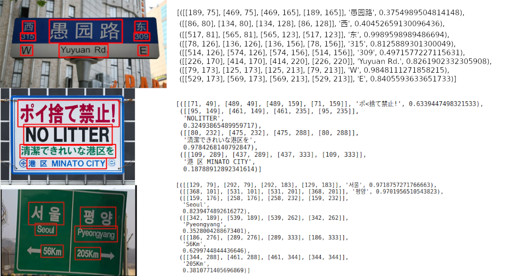
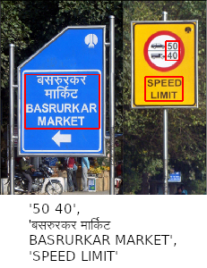
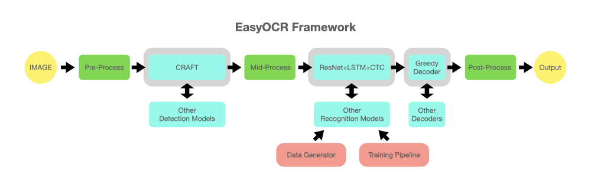

# EasyOCR

[](https://badge.fury.io/py/easyocr)
[](https://github.com/JaidedAI/EasyOCR/blob/master/LICENSE)
[](https://twitter.com/intent/tweet?text=Check%20out%20this%20awesome%20library:%20EasyOCR%20https://github.com/JaidedAI/EasyOCR)
[](https://twitter.com/JaidedAI)

Ready-to-use OCR with 80+ [supported languages](https://www.jaided.ai/easyocr) and all popular writing scripts including: Latin, Chinese, Arabic, Devanagari, Cyrillic, etc.

[Try Demo on our website](https://www.jaided.ai/easyocr)

Integrated into [Huggingface Spaces 🤗](https://huggingface.co/spaces) using [Gradio](https://github.com/gradio-app/gradio). Try out the Web Demo: [](https://huggingface.co/spaces/tomofi/EasyOCR)


## What's new
- 24 September 2024 - Version 1.7.2
    - Fix several compatibilities

- [Read all release notes](https://github.com/JaidedAI/EasyOCR/blob/master/releasenotes.md)

## What's coming next
- Handwritten text support

## Examples







## Installation

Install using `pip`

For the latest stable release:

``` bash
pip install easyocr
```

For the latest development release:

``` bash
pip install git+https://github.com/JaidedAI/EasyOCR.git
```

Note 1: For Windows, please install torch and torchvision first by following the official instructions here https://pytorch.org. On the pytorch website, be sure to select the right CUDA version you have. If you intend to run on CPU mode only, select `CUDA = None`.

Note 2: We also provide a Dockerfile [here](https://github.com/JaidedAI/EasyOCR/blob/master/Dockerfile).

## Usage

``` python
import easyocr
reader = easyocr.Reader(['ch_sim','en']) # this needs to run only once to load the model into memory
result = reader.readtext('chinese.jpg')
```

The output will be in a list format, each item represents a bounding box, the text detected and confident level, respectively.

``` bash
[([[189, 75], [469, 75], [469, 165], [189, 165]], '愚园路', 0.3754989504814148),
 ([[86, 80], [134, 80], [134, 128], [86, 128]], '西', 0.40452659130096436),
 ([[517, 81], [565, 81], [565, 123], [517, 123]], '东', 0.9989598989486694),
 ([[78, 126], [136, 126], [136, 156], [78, 156]], '315', 0.8125889301300049),
 ([[514, 126], [574, 126], [574, 156], [514, 156]], '309', 0.4971577227115631),
 ([[226, 170], [414, 170], [414, 220], [226, 220]], 'Yuyuan Rd.', 0.8261902332305908),
 ([[79, 173], [125, 173], [125, 213], [79, 213]], 'W', 0.9848111271858215),
 ([[529, 173], [569, 173], [569, 213], [529, 213]], 'E', 0.8405593633651733)]
```
Note 1: `['ch_sim','en']` is the list of languages you want to read. You can pass
several languages at once but not all languages can be used together.
English is compatible with every language and languages that share common characters are usually compatible with each other.

Note 2: Instead of the filepath `chinese.jpg`, you can also pass an OpenCV image object (numpy array) or an image file as bytes. A URL to a raw image is also acceptable.

Note 3: The line `reader = easyocr.Reader(['ch_sim','en'])` is for loading a model into memory. It takes some time but it needs to be run only once.

You can also set `detail=0` for simpler output.

``` python
reader.readtext('chinese.jpg', detail = 0)
```
Result:
``` bash
['愚园路', '西', '东', '315', '309', 'Yuyuan Rd.', 'W', 'E']
```

Model weights for the chosen language will be automatically downloaded or you can
download them manually from the [model hub](https://www.jaided.ai/easyocr/modelhub) and put them in the '~/.EasyOCR/model' folder

In case you do not have a GPU, or your GPU has low memory, you can run the model in CPU-only mode by adding `gpu=False`.

``` python
reader = easyocr.Reader(['ch_sim','en'], gpu=False)
```

For more information, read the [tutorial](https://www.jaided.ai/easyocr/tutorial) and [API Documentation](https://www.jaided.ai/easyocr/documentation).

#### Run on command line

```shell
$ easyocr -l ch_sim en -f chinese.jpg --detail=1 --gpu=True
```

## Train/use your own model

For recognition model, [Read here](https://github.com/JaidedAI/EasyOCR/blob/master/custom_model.md).

For detection model (CRAFT), [Read here](https://github.com/JaidedAI/EasyOCR/blob/master/trainer/craft/README.md).

## Implementation Roadmap

- Handwritten support
- Restructure code to support swappable detection and recognition algorithms
The api should be as easy as
``` python
reader = easyocr.Reader(['en'], detection='DB', recognition = 'Transformer')
```
The idea is to be able to plug in any state-of-the-art model into EasyOCR. There are a lot of geniuses trying to make better detection/recognition models, but we are not trying to be geniuses here. We just want to make their works quickly accessible to the public ... for free. (well, we believe most geniuses want their work to create a positive impact as fast/big as possible) The pipeline should be something like the below diagram. Grey slots are placeholders for changeable light blue modules.



## Acknowledgement and References

This project is based on research and code from several papers and open-source repositories.

All deep learning execution is based on [Pytorch](https://pytorch.org). :heart:

Detection execution uses the CRAFT algorithm from this [official repository](https://github.com/clovaai/CRAFT-pytorch) and their [paper](https://arxiv.org/abs/1904.01941) (Thanks @YoungminBaek from [@clovaai](https://github.com/clovaai)). We also use their pretrained model. Training script is provided by [@gmuffiness](https://github.com/gmuffiness).

The recognition model is a CRNN ([paper](https://arxiv.org/abs/1507.05717)). It is composed of 3 main components: feature extraction (we are currently using [Resnet](https://arxiv.org/abs/1512.03385)) and VGG, sequence labeling ([LSTM](https://www.bioinf.jku.at/publications/older/2604.pdf)) and decoding ([CTC](https://www.cs.toronto.edu/~graves/icml_2006.pdf)). The training pipeline for recognition execution is a modified version of the [deep-text-recognition-benchmark](https://github.com/clovaai/deep-text-recognition-benchmark) framework. (Thanks [@ku21fan](https://github.com/ku21fan) from [@clovaai](https://github.com/clovaai)) This repository is a gem that deserves more recognition.

Beam search code is based on this [repository](https://github.com/githubharald/CTCDecoder) and his [blog](https://towardsdatascience.com/beam-search-decoding-in-ctc-trained-neural-networks-5a889a3d85a7). (Thanks [@githubharald](https://github.com/githubharald))

Data synthesis is based on [TextRecognitionDataGenerator](https://github.com/Belval/TextRecognitionDataGenerator). (Thanks [@Belval](https://github.com/Belval))

And a good read about CTC from distill.pub [here](https://distill.pub/2017/ctc/).

## Want To Contribute?

Let's advance humanity together by making AI available to everyone!

3 ways to contribute:

**Coder:** Please send a PR for small bugs/improvements. For bigger ones, discuss with us by opening an issue first. There is a list of possible bug/improvement issues tagged with ['PR WELCOME'](https://github.com/JaidedAI/EasyOCR/issues?q=is%3Aissue+is%3Aopen+label%3A%22PR+WELCOME%22).

**User:** Tell us how EasyOCR benefits you/your organization to encourage further development. Also post failure cases in [Issue  Section](https://github.com/JaidedAI/EasyOCR/issues) to help improve future models.

**Tech leader/Guru:** If you found this library useful, please spread the word! (See [Yann Lecun's post](https://www.facebook.com/yann.lecun/posts/10157018122787143) about EasyOCR)

## Guideline for new language request

To request a new language, we need you to send a PR with the 2 following files:

1. In folder [easyocr/character](https://github.com/JaidedAI/EasyOCR/tree/master/easyocr/character),
we need 'yourlanguagecode_char.txt' that contains list of all characters. Please see format examples from other files in that folder.
2. In folder [easyocr/dict](https://github.com/JaidedAI/EasyOCR/tree/master/easyocr/dict),
we need 'yourlanguagecode.txt' that contains list of words in your language.
On average, we have ~30000 words per language with more than 50000 words for more popular ones.
More is better in this file.

If your language has unique elements (such as 1. Arabic: characters change form when attached to each other + write from right to left 2. Thai: Some characters need to be above the line and some below), please educate us to the best of your ability and/or give useful links. It is important to take care of the detail to achieve a system that really works.

Lastly, please understand that our priority will have to go to popular languages or sets of languages that share large portions of their characters with each other (also tell us if this is the case for your language). It takes us at least a week to develop a new model, so you may have to wait a while for the new model to be released.

See [List of languages in development](https://github.com/JaidedAI/EasyOCR/issues/91)

## Github Issues

Due to limited resources, an issue older than 6 months will be automatically closed. Please open an issue again if it is critical.

## Business Inquiries

For Enterprise Support, [Jaided AI](https://www.jaided.ai/) offers full service for custom OCR/AI systems from implementation, training/finetuning and deployment. Click [here](https://www.jaided.ai/contactus?ref=github) to contact us.


## 🌐 Web Resources & Interactive Index
- [CATEGORY MOUSE1 697](https://thequizzone.pages.dev/category-mouse1-697.html)
- [PRINCESS WINTER ICE SKATING OUTFITS](https://thequizzone.pages.dev/princess-winter-ice-skating-outfits.html)
- [CATEGORY DIRT BIKE](https://studyquests.pages.dev/category-dirt-bike.html)
- [INDEX21](https://iskillquest.pages.dev/index21.html)
- [CUTE CATS ADVENTURES](https://themindplay.pages.dev/cute-cats-adventures.html)
- [ZEN MASTER 3 TILES](https://themindplay.pages.dev/zen-master-3-tiles.html)
- [ZOMBIE DEFENSE WAR](https://themindplay.pages.dev/zombie-defense-war.html)
- [CATEGORY LOGIC538](https://themindplay.github.io/category-logic538.html)
- [ITALIAN ANIMAL ALCHEMY BRAINROT](https://quizverses.github.io/italian-animal-alchemy-brainrot.html)
- [XENO DEFENSE PROTOCOL](https://themindplays.pages.dev/xeno-defense-protocol.html)
- [CATEGORY FLASH 2](https://skillplay.github.io/category-flash-2.html)
- [INDEX13](https://skillplay.github.io/index13.html)
- [KINGDOM CATS](https://themindplay.pages.dev/kingdom-cats.html)
- [KINGDOM PUZZLES](https://learnquester.github.io/kingdom-puzzles.html)
- [CATEGORY ESCAPE 2](https://studyquesthub.web.app/category-escape-2.html)
- [COLLECT EM ALL](https://quizverses-9d2f2.web.app/collect-em-all.html)
- [MY ARCADE CENTER](https://learnquesters.pages.dev/my-arcade-center.html)
- [CATEGORY OBSTACLE299](https://themindskillplayplay.pages.dev/category-obstacle299.html)
- [GEAR WARS](https://themindplay.github.io/gear-wars.html)
- [CATEGORY SOLITAIRE27](https://learnquester.pages.dev/category-solitaire27.html)
- [IDLE ARCHEOLOGY](https://themindplay.github.io/idle-archeology.html)
- [TWO STUNT SUPERCARS](https://studyquesthub.web.app/two-stunt-supercars.html)
- [TAP 3D BLOCKS](https://theskillquest.pages.dev/tap-3d-blocks.html)
- [SWEET AND FRUITY MAKEUP](https://thelearnquesters.pages.dev/sweet-and-fruity-makeup.html)
- [FISH FEEDING](https://iskillplay.web.app/fish-feeding.html)
- [BATTLE OF PIRATE CARIBBEAN BATTLE](https://studyquests.github.io/battle-of-pirate-caribbean-battle.html)
- [CATEGORY POINT AND CLICK](https://themindplay.github.io/category-point-and-click.html)
- [GOMU GOMAN](https://themindskillplayplay.pages.dev/gomu-goman.html)
- [DRAW A PATH TO THE FINISH LINE](https://themindskillplayplay.pages.dev/draw-a-path-to-the-finish-line.html)
- [MERGE 3D MATCH 3 BALLOONS](https://skillplay.github.io/merge-3d-match-3-balloons.html)
- [CATEGORY ARENA255](https://learnquester.pages.dev/category-arena255.html)
- [BADLANDS HERO](https://skillplay.github.io/badlands-hero.html)
- [CATEGORY CASUAL971](https://quizverses-9d2f2.web.app/category-casual971.html)
- [MERGE SMITH](https://learnquester.pages.dev/merge-smith.html)
- [CATEGORY PLATFORM](https://themindplay.github.io/category-platform.html)
- [HIGHSCHOOL MEAN GIRLS 3](https://thelearnquesters.pages.dev/highschool-mean-girls-3.html)
- [CAR RACING 3D DRIVE MAD](https://themindplay.pages.dev/car-racing-3d-drive-mad.html)
- [CATEGORY OBBY](https://iskillquest.pages.dev/category-obby.html)
- [DAYCARE TYCOON](https://learnquester.pages.dev/daycare-tycoon.html)
- [SUDOKU PINGAMES](https://quizverses.github.io/sudoku-pingames.html)
- [SLAP MAN](https://studyplayings.web.app/slap-man.html)
- [INDEX21](https://skillplay.github.io/index21.html)
- [SHAPE TRANSFORMING SHIFTING RUN](https://themindplay.pages.dev/shape-transforming-shifting-run.html)
- [FASHION CHALLENGE CATWALK RUN](https://theskillquest.pages.dev/fashion-challenge-catwalk-run.html)
- [INDEX8](https://studyplayings.pages.dev/index8.html)
- [CRAZY FRUIT MERGE](https://themindzone.pages.dev/crazy-fruit-merge.html)
- [CATEGORY MINECRAFT](https://iskillquest.pages.dev/category-minecraft.html)
- [SCARY PAIRS](https://quizverses.github.io/scary-pairs.html)
- [TINY BAKER RAINBOW BUTTERCREAM CAKE](https://iskillplay.web.app/tiny-baker-rainbow-buttercream-cake.html)
- [WORLD SOCCER](https://iskillplay.web.app/world-soccer.html)
- [GUESS THE ITALIAN BRAINROT ANIMALS](https://learnquester.github.io/guess-the-italian-brainrot-animals.html)
- [CATEGORY ROGUELIKE38](https://studyplayings.pages.dev/category-roguelike38.html)
- [BATTLE RACING STARS](https://iskillplay.web.app/battle-racing-stars.html)
- [TILE HEX WORLD RED VS BLUE](https://studyquesthub.web.app/tile-hex-world-red-vs-blue.html)
- [CATEGORY DRAWING](https://studyplayings.pages.dev/category-drawing.html)
- [COIN BLITZ](https://studyquesthub.web.app/coin-blitz.html)
- [CITYQUEST](https://themindzone.pages.dev/cityquest.html)
- [THE OFFICE ESCAPE](https://themindplay.pages.dev/the-office-escape.html)
- [SAVE THE BEAUTY](https://quizverses.github.io/save-the-beauty.html)
- [CATEGORY ART32](https://thequizzone.pages.dev/category-art32.html)
- [INDEX5](https://skillplay.github.io/index5.html)
- [PUZZLE SOLITAIRE PICTURE MATCH](https://thequizzone.pages.dev/puzzle-solitaire-picture-match.html)
- [INDEX6](https://quizverses-9d2f2.web.app/index6.html)
- [FISH RAIN 2](https://themindplays.pages.dev/fish-rain-2.html)
- [CATEGORY CASUAL](https://skillplay.github.io/category-casual.html)
- [CATEGORY SOLITAIRE](https://themindplay.github.io/category-solitaire.html)
- [MAGIC CHRISTMAS TREE MATCH 3](https://themindplay.github.io/magic-christmas-tree-match-3.html)
- [CUBE TO HOLE PUZZLE](https://quizverses.github.io/cube-to-hole-puzzle.html)
- [INDEX8](https://thequizzone.pages.dev/index8.html)
- [NUBIK CREATE YOUR PLACE](https://themindplays.pages.dev/nubik-create-your-place.html)
- [CATEGORY MEME BLOXY24](https://iskillquest.pages.dev/category-meme-bloxy24.html)
- [MERGE TIKTOK GRAVITY KNIFE](https://iskillplay.web.app/merge-tiktok-gravity-knife.html)
- [SHELL STRIKERS](https://studyplayings.web.app/shell-strikers.html)
- [MAGES SECRET](https://thelearnquesters.pages.dev/mages-secret.html)
- [WORD SEARCH UNIVERSE ANIMALS](https://quizverses.github.io/word-search-universe-animals.html)
- [FASHION DYE PRO](https://thequizzone.pages.dev/fashion-dye-pro.html)
- [COLOR DODGE](https://themindplay.pages.dev/color-dodge.html)
- [BIG BLOCK BLAST](https://learnquester.github.io/big-block-blast.html)
- [FIND THE CAT CAT SEARCH](https://studyquesthub.web.app/find-the-cat-cat-search.html)
- [PICTURE BY PIECES](https://thequizzone.pages.dev/picture-by-pieces.html)
- [ZEN TILE](https://thequizzone.pages.dev/zen-tile.html)
- [CATEGORY PUZZLE 4](https://themindplay.github.io/category-puzzle-4.html)
- [BANK ROBBERY ESCAPE](https://quizverses.github.io/bank-robbery-escape.html)
- [BREAK THE BLOCK THERE BRAINROT](https://learnquester.github.io/break-the-block-there-brainrot.html)
- [ELLIE CHRISTMAS MAKEUP](https://studyquests.github.io/ellie-christmas-makeup.html)
- [CATEGORY BYEPASSHUB](https://learnquester.pages.dev/category-byepasshub.html)
- [STACK N SORT](https://quizverses.github.io/stack-n-sort.html)
- [POPCORN STACK](https://thequizzone.pages.dev/popcorn-stack.html)
- [CATEGORY ESCAPE 3](https://themindskillplayplay.pages.dev/category-escape-3.html)
- [K WEDDING DREAM](https://themindplay.pages.dev/k-wedding-dream.html)
- [INDEX7](https://iskillquest.pages.dev/index7.html)
- [CATEGORY IDLE](https://themindplay.github.io/category-idle.html)
- [DICTATOR SIMULATOR 1984](https://learnquester.pages.dev/dictator-simulator-1984.html)
- [HEXA BLAST GAME PUZZLE](https://thequizzone.pages.dev/hexa-blast-game-puzzle.html)
- [CODE MAZE](https://themindplays.pages.dev/code-maze.html)
- [WORD STARS](https://learnquester.github.io/word-stars.html)
- [2048 SORT FACTORY](https://themindplaying.web.app/2048-sort-factory.html)
- [2048 BLOCKS DESTRUCTION](https://iskillplay.web.app/2048-blocks-destruction.html)
- [PIGGY CLICKER](https://skillplay.github.io/piggy-clicker.html)
- [MUSHROOM FEVER MATCH 3](https://studyquesthub.web.app/mushroom-fever-match-3.html)
- [CATEGORY MANAGEMENT](https://studyplayings.pages.dev/category-management.html)
- [RACING FOR TWO ON ONE PC](https://studyquests.github.io/racing-for-two-on-one-pc.html)
- [MEATRIDER](https://learnquester.pages.dev/meatrider.html)
- [CATEGORY LOVE12](https://themindplay.github.io/category-love12.html)
- [CYBERPUNK CITY HAIRSTYLES](https://learnquester.pages.dev/cyberpunk-city-hairstyles.html)
- [PERFECT TIDY](https://studyquesthub.web.app/perfect-tidy.html)
- [CATEGORY MAKEUP51](https://themindskillplayplay.pages.dev/category-makeup51.html)
- [MR DISC SLINGSHOT STRIKE](https://thelearnquesters.pages.dev/mr-disc-slingshot-strike.html)
- [MONSTER IMPACT](https://learnquester.github.io/monster-impact.html)
- [BIG BAD APE](https://theskillquest.pages.dev/big-bad-ape.html)
- [MAHJONG CONNECT FISH WORLD](https://studyquesthub.web.app/mahjong-connect-fish-world.html)
- [MAGIC TOWERS SOLITAIRE](https://themindplay.github.io/magic-towers-solitaire.html)
- [FLOAT FOR BRAINROTS](https://studyplayings.pages.dev/float-for-brainrots.html)
- [SHOOT RUN MONSTER HUNTING](https://themindplaying.web.app/shoot-run-monster-hunting.html)
- [MERGE FUSION](https://quizverses.github.io/merge-fusion.html)
- [GOLDEN FRONTIER](https://themindplay.pages.dev/golden-frontier.html)
- [BUNNYS FARM](https://studyquesthub.web.app/bunnys-farm.html)
- [KOKO LOCO BLOCK BLAST](https://skillplay.github.io/koko-loco-block-blast.html)
- [VISUAL MEMORY DRAG DROP](https://thequizzone.pages.dev/visual-memory-drag-drop.html)
- [SPRUNKI SPACE CHALLENGE](https://studyquests.github.io/sprunki-space-challenge.html)
- [WIRE CONNECT](https://quizverses.github.io/wire-connect.html)
- [DYE IT RIGHT COLOR PICKER](https://themindplays.pages.dev/dye-it-right-color-picker.html)
- [DROP KICK WORLD CUP 2018](https://studyquests.github.io/drop-kick-world-cup-2018.html)
- [EXO OBSERVATION](https://themindplay.github.io/exo-observation.html)
- [ROBLOX HALLOWEEN COSTUME PARTY](https://iskillquest.pages.dev/roblox-halloween-costume-party.html)
- [GEOMETRY SUBZERO](https://skillplay.github.io/geometry-subzero.html)
- [SPRUNKI QUIZ](https://themindskillplayplay.pages.dev/sprunki-quiz.html)
- [CATEGORY BATTLE](https://themindplay.pages.dev/category-battle.html)
- [TILE CONNECT PAIR MATCH PUZZLE](https://thelearnquesters.pages.dev/tile-connect-pair-match-puzzle.html)
- [ANACONDA RUNNER](https://studyquests.github.io/anaconda-runner.html)
